<p align="center">
  
</p>

<p align="center">
  
</p>

# 🎨 assets · Identidad Visual Ulogix

Repositorio centralizado de recursos gráficos SVG para todos los repositorios del equipo **Ulogix**. Todos los `README.md` del proyecto deben referenciar este repositorio para mantener coherencia visual.

<p align="center">
  
</p>

## 📁 Estructura

```
assets/
├── logos/
│   ├── ulogix-logo-dark.svg          # Logo completo sobre fondo oscuro
│   └── ulogix-logo-transparent.svg   # Logo con fondo transparente (color)
├── banners/
│   ├── header-banner.svg             # Banner animado principal (800×120)
│   └── footer-banner.svg             # Banner de pie de página (800×60)
├── dividers/
│   ├── divider-main.svg              # Divisor principal animado
│   └── divider-section.svg           # Divisor de sección con corchetes
├── icons/
│   └── node-tech.svg                 # Ícono técnico animado
└── backgrounds/
    └── .gitkeep
```

<p align="center">
  
</p>

## 🎨 Paleta de Colores

| Token | Hex | Uso |
|---|---|---|
| `--color-bg` | `#070213` | Fondo principal oscuro |
| `--color-bg-mid` | `#0e0525` | Fondo medio (gradientes) |
| `--color-primary` | `#7C3AED` | Violeta primario (Ulogix) |
| `--color-accent` | `#a855f7` | Violeta claro / acento |
| `--color-white` | `#FFFFFF` | Texto principal |
| `--color-muted` | `rgba(168,85,247,0.5)` | Texto secundario |

## ✍️ Tipografía

- **Display / Código**: `'Courier New', monospace` — usado en banners y labels técnicos
- **Texto README**: Markdown por defecto de GitHub

<p align="center">
  
</p>

## 🔗 Cómo usar en otros READMEs

Referenciar los assets con URL raw de GitHub:

```markdown
<!-- Banner de cabecera -->
<p align="center">
  
</p>

<!-- Divisor -->


<!-- Logo -->

```

<p align="center">
  
</p>

## 👥 Equipo

| Rol | Nombre | GitHub |
|---|---|---|
| Arquitectura de Red | Andrés M. Morales | [@mora200217](https://github.com/mora200217) |
| Robótica / RobotStudio | Andrés F. Quenan | [@Andres-Felipe-Quenan](https://github.com/Andres-Felipe-Quenan) |
| PLC / Programación | Juan José Díaz | [@Judiazgu](https://github.com/Judiazgu) |
| NX / Digital Factory | Juan M. Beltrán | [@JuanBeltran2024](https://github.com/JuanBeltran2024) |
| Planeación de Proceso | Jorge N. Garzón | [@Nicolas-Eule](https://github.com/Nicolas-Eule) |
| Finanzas | Samuel D. Sánchez | [@samsanchezcar](https://github.com/samsanchezcar) |
| SCADA / HMI / MES | Juan F. Triana | [@jutrianaa](https://github.com/jutrianaa) |

<p align="center">
  
</p>
