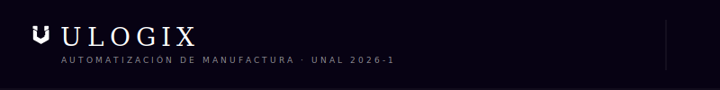
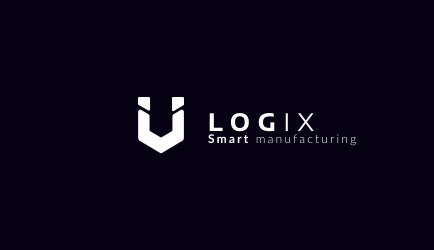
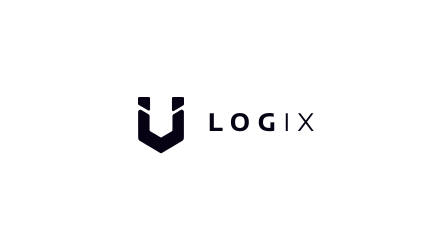
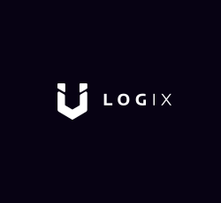
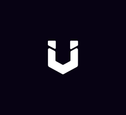
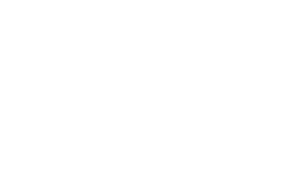
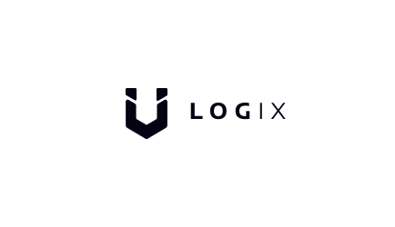
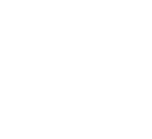
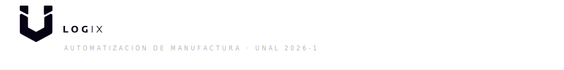
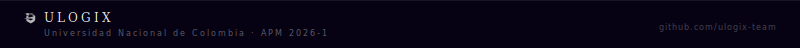

# assets · Identidad Visual Ulogix

Repositorio centralizado de recursos gráficos SVG para todos los repositorios del equipo **Ulogix**. Todos los paths son los originales del archivo de diseño Figma.


## Logos

<table>
<tr>
  <th>Archivo</th><th>Vista previa</th><th>Uso</th>
</tr>
<tr>
  <td><code>logos/ulogix-dark.svg</code></td>
  <td></td>
  <td>Logo completo sobre fondo oscuro (434×250)</td>
</tr>
<tr>
  <td><code>logos/ulogix-light.svg</code></td>
  <td></td>
  <td>Logo completo sobre fondo blanco (434×250)</td>
</tr>
<tr>
  <td><code>logos/ulogix-wordmark-dark.svg</code></td>
  <td></td>
  <td>Logo con tagline, fondo oscuro (434×250)</td>
</tr>
<tr>
  <td><code>logos/ulogix-icon-dark.svg</code></td>
  <td></td>
  <td>Solo ícono, fondo oscuro (250×229)</td>
</tr>
<tr>
  <td><code>logos/ulogix-icon-dark-alt.svg</code></td>
  <td></td>
  <td>Solo ícono variante, fondo oscuro (250×229)</td>
</tr>
<tr>
  <td><code>logos/ulogix-transparent-dark.svg</code></td>
  <td></td>
  <td>Logo sin fondo, paths blancos (434×250)</td>
</tr>
<tr>
  <td><code>logos/ulogix-transparent-light.svg</code></td>
  <td></td>
  <td>Logo sin fondo, paths #070213 (434×250)</td>
</tr>
<tr>
  <td><code>logos/ulogix-icon-transparent-dark.svg</code></td>
  <td></td>
  <td>Ícono sin fondo, blanco (250×229)</td>
</tr>
<tr>
  <td><code>logos/ulogix-icon-transparent-light.svg</code></td>
  <td></td>
  <td>Ícono sin fondo, #070213 (250×229)</td>
</tr>
</table>


## Banners

| Archivo | Dimensiones | Animaciones |
|---|---|---|
| `banners/header-dark.svg` | 800×100 | Scan line · icon breathe · tagline fade |
| `banners/header-light.svg` | 800×100 | Scan line · icon breathe · tagline fade |
| `banners/footer-dark.svg` | 800×52 | Dot viajero en regla · icon pulse |







## Divisores

| Archivo | Fondo | Animaciones |
|---|---|---|
| `dividers/divider-dark.svg` | Transparente | 2 dots viajeros · expansión desde centro · diamond pulse |
| `dividers/divider-section-dark.svg` | Transparente | Brackets · ticks escalonados · dot central · line breathe |
| `dividers/divider-light.svg` | Transparente | Igual que dark, strokes #070213 |


## Ícono Técnico

`icons/node-tech.svg` — ícono animado con el mark U y anillos orbitantes. Usado en sub-READMEs de módulos técnicos.

<p align="center">
  
</p>


## Sistema de Color

| Token | Valor | Uso |
|---|---|---|
| Dark background | `#070213` | Fondo principal |
| Light background | `#FFFFFF` | Variante light |
| Paths sobre dark | `#FFFFFF` | Ícono y texto sobre `#070213` |
| Paths sobre light | `#070213` | Ícono y texto sobre blanco |

> Identidad **bicolor y minimalista**. Sin gradientes. Todos los paths son originales del archivo Figma.


## Uso en READMEs

```markdown


```


## Equipo

| Nombre | Rol | GitHub |
|---|---|:---:|
| Andrés Mauricio Morales Martínez | Arquitectura de Red | [@mora200217](https://github.com/mora200217) |
| Andrés Felipe Quenan Pozo | Robótica / RobotStudio | [@Andres-Felipe-Quenan](https://github.com/Andres-Felipe-Quenan) |
| Juan José Díaz Guerrero | PLC / Programación | [@Judiazgu](https://github.com/Judiazgu) |
| Juan Manuel Beltrán Botello | NX / Digital Factory | [@JuanBeltran2024](https://github.com/JuanBeltran2024) |
| Jorge Nicolas Garzón Acevedo | Planeación de Proceso | [@Nicolas-Eule](https://github.com/Nicolas-Eule) |
| Samuel David Sanchez Cardenas | Finanzas | [@samsanchezcar](https://github.com/samsanchezcar) |
| Juan Felipe Triana Aguilera | SCADA / HMI / MES | [@jutrianaa](https://github.com/jutrianaa) |


